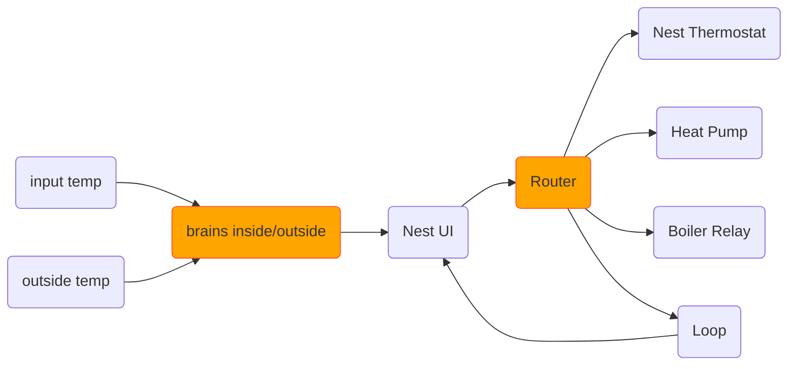

# Node-RED-HVAC
Combination of Home Assistant and Node-RED to control our complicated home HVAC.

- We have 3 zones - den, upstairs and office
- We have 5 time periods - early_morning, morning, afternoon, evening, and overnight
- We have 3 scenarios - WFH, weekend, at_work

Whatever the scenario, evening and overnight are the same. Office only needs heat when WFH.

**This all started as our Gen-1 Nest Thermostats now have dead batteries and lose connectivity all the time.** I want to use multiple sensors in each zone to control the boiler, and have the Nest be a dumb input into the system, permanently wired to the 24v transformer and not control anything directly.

## Home Assitant Scheduling and Zone Climate Control

### Schedule
We've split the day up into 5 segments using Home Assistant

```yaml
binary_sensor:
  # Early Morning
  - platform: tod
    name: TOD_EarlyMorning
    after: "06:00"
    before: "08:00"
    unique_id: tod_earlymorning
  # Morning
  - platform: tod
    name: TOD_Morning
    after: "08:00"
    before: "12:00"
    unique_id: tod_morning
  # Afternoon
  - platform: tod
    name: TOD_Afternoon
    after: "12:00"
    before: "16:00"
    unique_id: tod_afternoon
  # Evening
  - platform: tod
    name: TOD_Evening
    after: "16:00"
    before: "21:00"
    unique_id: tod_evening
  # Overnight
  - platform: tod
    name: TOD_Overnight
    after: "21:00"
    before: "06:00"
    unique_id: tod_overnight
```
We use a series of 'input number' entities to set the temperature target for the day.


Using a 'binary input' we can tell Home Assistant if we're working from home that day or not and to adjust the temperatures accordingly using a series of gates. The gates also know if it is the weekend or not.


### Zones


The brains function isn't as smart as it once was, but if it's warmer outside than inside it tells the target device to turn off. Mainly for the Heat Pumps as they get confused easily.

The 'Router' function is now the one doing all the hard work, splitting the inputs into information for each target device, and detecting if there is a manual override in place.



```javascript
// the internals
var outside, stat, hvac_state;
var nest_temp, nest_mode;
var minisplit_temp, minisplit_mode;

// the inputs
var temp = msg.payload["target_temperature"]; 
var mode = msg.payload["hvac_mode"];
var bias = flow.get("bias");
var source = msg.payload["source"];

// the outputs
var lock = {};
var nest = {};          // heat or cool only
var minisplit = {};     // heat, cool or off
var generic = {};       // heat or cool only
var loop = {};          // original message with new topic

// the clever bits
if (source == "UI") {  // change the source lock
    //node.warn("UI");    
    lock.payload = "UI";
    } else if (source == "loop") {
    //node.warn("loop");
    lock.payload = "loop";
    } else {
    //node.warn("brains");
    lock.payload = "brains";
    }

if (temp > flow.get("temp_bed")) {
    hvac_state = "heating";
} else {
    hvac_state = "off";
}

nest_temp = temp + bias;
minisplit_temp = temp - bias;
nest_mode = "heat";
minisplit_mode = mode;

nest.payload = {
    data: {
        "temperature": nest_temp,
        "hvac_mode": nest_mode
        }
    };

if (minisplit_mode == "off") {
    minisplit.payload = {
        service: "turn_off",
        data: "off"
    };
} else {
    minisplit.payload = {
        service: "set_temperature",
        data: {
            "temperature": minisplit_temp,
            "hvac_mode": minisplit_mode,

        }
    };
}

generic.payload = {
    data : {
        "temperature": nest_temp,
        "hvac_mode": nest_mode
        }
    }

loop.payload = {
    "ambient_temperature": flow.get("temp_bed"),
    "target_temperature": msg.payload["target_temperature"],
    "hvac_state": hvac_state,
    "hvac_mode": msg.payload["hvac_mode"],
    "has_leaf": msg.payload["has_leaf"],
    "away": false,
    "source": "loop"
    }

flow.set("bed_last", loop.payload ); // used for reinjecting when on lock

stat = "nest: "+ nest_temp+ " / msp: "+ minisplit_temp;
node.status({ fill: "green", shape: "dot", text: stat });
return [lock, nest, minisplit, generic, loop];
```

## Bias Mode
As the outside temperature gets colder the efficiency of the heat pumps also drops, so to compensate there is a bias.

At the moment this is set up as follows:
| Temp Range | Bias |
| --- | --- |
| < 0 | 2
| < 37 | 1
| < 50 | 0
| > 50 | -1

~~The bias number is added to the setting for the gas heating~~ _Change to_ The bias number is subtracted from the heat pump target temperature
```
var stat;

if (msg.outside < 0) {
    msg.bias = 2;
    stat = "really frickin cold [2]";
    flow.set("bias", 2);
    node.status({ fill: "blue", shape: "ring", text: stat });

} else if (msg.outside < 37) {
    stat = "frickin cold [1]";
    node.status({ fill: "yellow", shape: "ring", text: stat });
    flow.set("bias", 1);    
    msg.bias = 1;

} else if (msg.outside < 50) {
    stat = "cold [0]";
    node.status({ fill: "green", shape: "ring", text: stat }); 
    flow.set("bias", 0);   
    msg.bias = 0;

} else {
    stat = "not bad [-1]";
    node.status({ fill: "red", shape: "ring", text: stat });    
    msg.bias = -1;
    flow.set("bias", -1);
}
    return msg; 
```

## Dashboard and Locking


